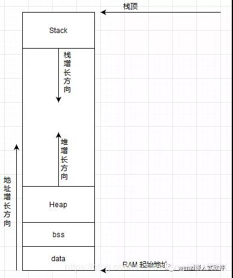

### 内存映射
+ 在一些桌面程序中，整个内存映射是通过虚拟内存来进行管理的，使用一种称为内存管理单元(MMU)的硬件结构来将程序的内存映射到物理RAM。在对于 RAM 紧缺的嵌入式系统中，是缺少 MMU 内存管理单元的。因此在一些嵌入式系统中，比如常用的 STM32 来讲，内存映射被划分为闪存段（也被称为Flash,用于存储代码和只读数据)和RAM段，用于存储读写数据。


+ 可以看到 RAM 地址是从 0x2000 0000 开始的，Flash地址是从 0x0800 0000 开始的

### flash
代码和数据都存于flash。
对于ARM Cortex M3来说，Flash中可以分为，文本段（代码+常量），只读数据区，复制区（存放初始化为非零的全局变量的值）全局变量是存放在 RAM 上的，RAM 上的值掉电便丢失，每次上电后这些变量是要进行重新赋值的，而重新赋的值就存放在这里。那为什么不存放初始化为 0 的全局变量初始值呢，原因也很简单，既然是初始化为 0,那么在上电后统一对存放初始化为 0 的全局变量的那块区域清0就好了。


```c
#include<stdio.h>

const int read_only_variable =2000;
int data = 500;

void my_function(void)
{
	int x = 200；    
	char *str = "string";
}
```
+ 在上述代码中，read_only_variable 是一个用 const 修饰的全局变量，它是只读的，存放在 flash 中的只读数据区域，编译器会给 read_only_variable 分配一个地址，并将 2000 这个数据存放到这个位置。data 这个变量将存放到 RAM 中的RW区域中 (后面将会进行详细讲解)，但是 data 后面的初始值 500 将会被存放到数据复制区域中， 也就是上图中从下往上的第三个区域。在 my_function 中的变量 x 将会被存放到 RAM 中的堆栈中，将 x 赋值为 200 ,200 将被存储到 flash 里的 Text 中的常量区 (Literal Valu) 中。str 是一个 char 型的指针变量，它指向的是字符串第一个字符存放的位置，然而对于字符串 string 来讲，它是存放在Text常量区的，所以指针变量指向这个区域的一个地址，但是因为它终归中局部变量，它指向 Flash 的一个地址，但是其本身还是存放于 RAM 中的堆栈上的。

### RAM
STM32单片机的片内RAM会被链接文件分区”为如下几个段：

“

+ 栈 (Stack) : 存放局部变量和函数调用时的返回地址
+ 堆 (heap) : 由 malloc 申请，由 free 释放
+ bss : 存放未初始化或者是初始化为 0 的全局变量、全局静态变量和局部静态变量
+ data : 存放已经初始化的非0的全局变量、全局静态变量和局部静态变量

```c
#include<stdio.h>
#include<stdlib.h>
int data_var = 500;
int bss_var0;
int bss_var1 = 0;
static int static_var;

void my_function(void)
{
	static int static_var1 = 0;
    int stack = 0;
    char *buffer;    
	const int value = 1;
    buffer = malloc(10);
}
```

+ 上述变量的命名已经很清楚地表明了变量处于 RAM 中的哪一个段，**datavar 是已经初始化的全局变量，存放在 RAM 的 data 区，bssvar0 和 bssvar1是未初始化和初始化为0的全局变量，他们都存放于 RAM 中的 bss段**，由 **static 修饰的staticvar 和 static_var1 都存放于 bss段**，区别只在于两个变量的作用域不同。stack 是在函数内部定义的局部变量，其存放于 RAM 的栈区域，**用 const 修饰的局部变量 value ,虽然他是只读的，但是它是存储于 RAM 中的栈中的，这里也说明一点，并不是所有用 const 修饰的变量都是存放于只读变量区的**。buffer指针变量用 malloc 函数申请了 10 字节的内存空间，那这10字节的内存空间位于堆中。

### 堆栈溢出
如果在程序运行的过程中，堆的空间也一直在消耗，同时栈的空间也在增加，那么这时堆和栈如果碰到一起，那么就会造成堆栈溢出，从而导致我们的程序跑飞。

### STM32中的map文件分析
在用 keil 编译 STM32 工程之后，我们会得到一个 map 文件，map 文件的最底部有这么一个信息：图片上图中的各个段是和上文所述是能够进行对应起来的，正如下面这张表所示：


|Code	|RO Data	|RW Data	|ZI Data|
|---|---|---|---|
|Executable Code|	Read Only Data|	data	|bss|

段(section) ：描述映像文件的代码和数据块。

**RO**：Read-Only的缩写，包括RO-data(只读数据)和RO-code(代码)。
**RW**：Read-Write的缩写，主要是RW-data，RW-data由程序初始化初始值。 
**ZI**：Zero-initialized的缩写，主要是ZI-data，由编译器初始化为0。 
**.text**：与RO-code同义。
**.constdata**：与RO-data同义。 
**.bss**： 与ZI-data同义。
**.data**：与RW-data同义