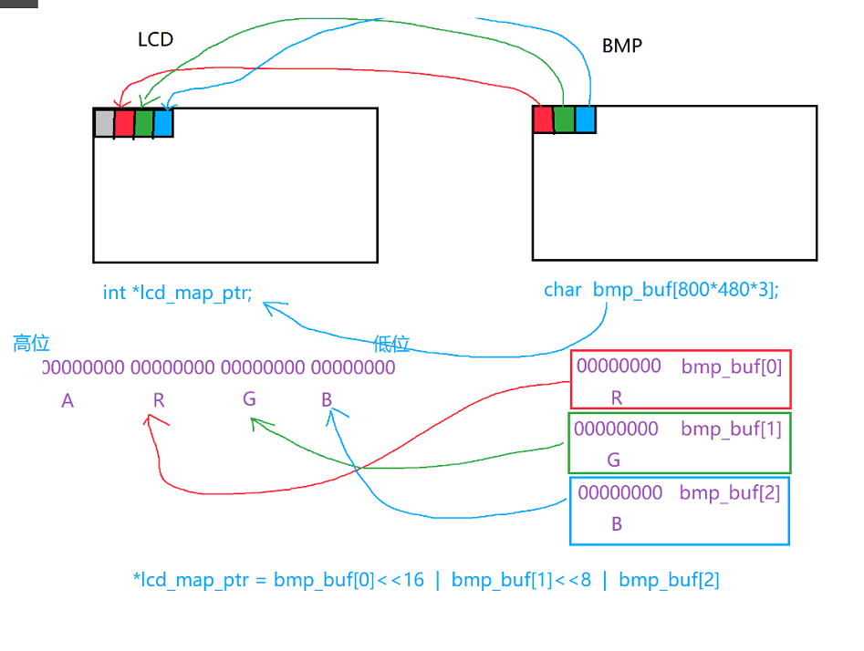
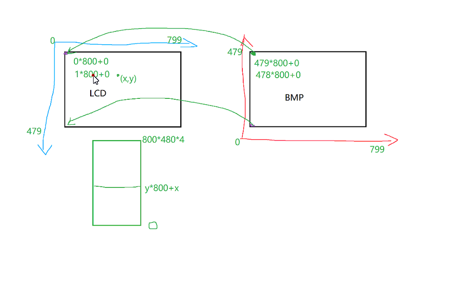

## 基本概念

屏幕都是由一个一个像素点组成的，例如，800\*480的ARGB像素屏幕，表示有800\*480个像素点，从左上角开始编号，0，一直递增一行一行的，第二行则是800开始，第三行则是1600开始依次递增，LCD便是根据这个位置来写入每一个像素点的数据。像素点 ARGB 为 OX00000000，每两位表示一个像素点信息，A为灰色，R为红色，G为绿色，B为蓝色。依照这个原理可以进行填充，遍历所有像素点，完成屏幕读写。

### BMP图片

一般要转换为24位图（RGB）的BMP图片才能显示。BMP就是RGB图片，一个像素点有三个颜色，每个颜色有两个字节（8位）。由于微软会自动给转换的图片加上一些特定自己，所以我们应该要记得用lseek跳过一些头文件的信息。

  