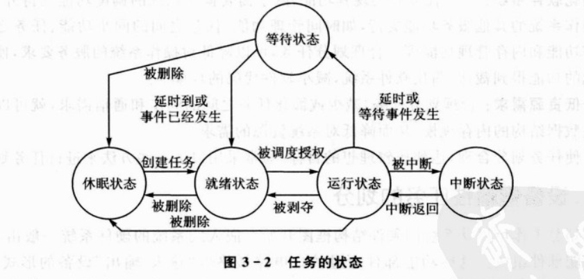

### 嵌入式实时操作系统
#### 内存管理
操作系统提供内存分配函数，调用完了需要使用内存释放函数把内存还给系统
#### 多任务管理
任务调度系统，控制任务的启动、运行、暂停和结束等状态，调度算法是满足实时性要求的，对时间非常敏感
#### 外围资源管理
系统可能用的资源，需要进行合理的裁剪，或者是预留接口

### 通用操作系统与嵌入式操作系统
通用操作系统需要将程序搬运到内存中，内存中掉电会丢失
嵌入式操作系统使用的内存不多，则是就地存储运行，不需要搬运

### 进程和线程

​	人们把能实现某些功能的代码叫做程序、但是在操作系统中，这些程序不能直接执行，因为操作系统没有足够的信息来管理它。所以当这种程序加载到系统之后，系统必须为这个程序分配并且建立一个控制块，在UCOSII中，就是任务控制块。它记录管理所需要的各种信息，其中最基本的就是任务堆栈和程序代码。此时，程序进入了操作系统需要改名字。控制块中记录了程序的断点值，也即是程序断点处程序计数器PC的值，这个值是程序待执行的地址，它发你赢了一个程序的运行进程于是上述存在于内存并几首系统管理的带哟任务控制块的程序实体，在计算机中根据不同的情况分为了进程或者线程。

**进程**：
带有独立内存运行空间的叫做进程，例如通常编写的C程序，在运行时，它在内存中的实体级就叫做进程。
**线程**：
多个运行程序共用一个内存空间，它们整体叫做进程，而这里面的单个实体则叫做线程。

+ UCOSII中并没有给任务分配单独运行的空间，所以他所有的任务都公用一个内存空间，一个任务则是一个线程！！！

### 任务状态

+ 睡眠状态（在宿舍睡觉，啥都不能做，起来了就上路了）没有被分配任务控制块或被剥夺了任务控制块
+ 就绪状态（在路上的状态，可以前往教室或者前往寝室睡觉）在任务就绪表中国进行了就绪登记
+ 运行状态（在教室上课，上完课可以直接上路，也可以直接飞到寝室睡觉，同时也可以去中转站等待，看看是飞去睡觉还是走路回去）就绪状态获得CPU使用权则转入运行,任何时刻只能有一个任务,
+ 中断服务状态（在上课被叫出去做事,做完再回来）执行中断服务程序
+ 等待状态(在此处进行中转,看看是飞到寝室还是走路)正在运行的任务需要等待一段时间或者等待一个事件触发,交出CPU使用权,进入等待.

### 任务堆栈

在存储器中按照后进先出的原则的连续存储空间.满足任务切换和响应中断时保存CPU寄存器钟的内容以及任务调用其他函数时需要.每个任务都有自己的堆栈.所有ucosII都含有一个指向盖任务堆栈的指针.
堆栈增长方向在不同的处理器中不同,任务堆栈需要初始化,此函数也需要根据不同的机器来编写.

