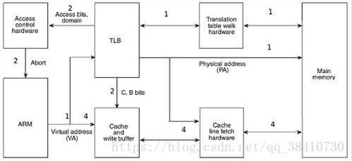

# 大疆嵌入式笔试题总结分析

版权声明：本文为CSDN博主「Yngz_Miao」的原创文章，遵循CC 4.0 BY-SA版权协议，转载请附上原文出处链接及本声明。
原文链接：https://blog.csdn.net/qq_38410730/article/details/80895986

**经典！！！**

## 一、结构体|不同位编译器各变量大小|大小端判断与转化

1)在一台64位的机器上，使用32位编译，Garfield变量占用多少内存空间？64位编译又是如何？（总分5分）

2)使用32位编译情况下，给出一种判断所使用机器大小端的方法。（总分5分）

```c
struct CAT_s
{
    int ld;
    char Color;
    unsigned short Age;
    char *Name;
    void(*Jump)(void);
}Garfield;
```


> 经典结构体对齐问题，把握之前总结的四个原则即可。此处注意，32位编译器与64位编译器，前者指针大小是4字节，后者为8字节。前者的long类型是4字节，后者是8字节，前者的long double为12位（10位有效），后者为16位（10位有效）。

>大小端转化有联合体union的存放顺序是所有成员都从低地址开始存放的特性，也有指针强制转化，与之前总结的一致。

### 2.1大小端转换函数：

```c
int small_to_big(int num)
{
    int reslut = 0;
    int i = 0;
    for(i = 0;i < sizeof(num);i++)
    {
        result <<= 8;
        result |= (num&0xff);
        num >>= 8; 
    }
    return reslut;
}
```


## 二、宏定义分析(经典)

2、描述下面XXX这个宏的作用。（总分10分）

```c
#define offsetof(TYPE,MEMBER) ((size_t)&((TYPE*)0)->MEMBER)
#define XXX(ptr,type,member)({\
    const typeof(((type*)0)->member) *__mptr=(ptr);\
    (type*)((char*)__mptr – offsetof(type,member));})
```

先来看第一个宏定义：

)0：将0强转为TYPE类型的指针，且指向了0地址空间；
(TYPE*)0->MEMEBER：指向结构体中的成员；
&((TYPE*)0->MEMBER)：获取成员在结构体的位置，因为起始为0，所以获取的地址即为实际的偏移地址。
分析：(TYPE *)0，将 0 强制转换为 TYPE 型指针，记 p = (TYPE *)0，p是指向TYPE的指针，它的值是0。那么 p->MEMBER 就是 MEMBER 这个元素了，而&(p->MEMBER)就是MENBER的地址，而基地址为0，这样就巧妙的转化为了TYPE中的偏移量。再把结果强制转换为size_t型的就OK了，size_t其实也就是unsigned int。


再来看需要我们描述功能的宏定义XXX：
typeof构造的主要应用是用在宏定义中。可以使用typeof关键字来引用宏参数的类型。也就是说，typeof(((type*)0)->member)是引用与type结构体的member成员的数据类型；
获得了数据类型之后，定义一个与type结构体的member成员相同的类型的指针变量__mptr，且将ptr值赋给它；
用宏offsetof(type,member),获取member成员在type结构中的偏移量；
最后将__mptr值减去这个偏移量，就得到这个结构变量的地址了（亦指针）。
XXX宏的实现思路：计算type结构体成员member在结构体中的偏移量，然后ptr的地址减去这个偏移量，就得出type结构变量的首地址。

具体的功能就是：ptr是指向正被使用的某类型变量指针；type是包含ptr指向的变量类型的结构类型；member是type结构体中的成员，类型与ptr指向的变量类型一样。功能是计算返回包含ptr指向的变量所在的type类型结构变量的指针。

参考文章：[老生常谈的Linux内核中常用的两个宏定义](https://blog.csdn.net/feiyanaffection/article/details/79282562)。


## 三、函数调用知识点

**3、简述C函数：**

1)参数如何传递（__cdecl调用方式）；

2)返回值如何传递；

3)调用后如何返回到调用前的下一条指令执行。（总分10分）


### 3.1 参数如何传递（__cdecl调用方式）

1)参数如何传递 （__cdecl调用方式） ：

__cdecl是C Declaration的缩写（declaration，声明），是C语言中函数调用约定中的一种（默认）。

什么是函数调用约定？

当一个函数被调用时，函数的参数会被传递给被调用的函数，同时函数的返回值会被返回给调用函数。函数的调用约定就是用来描述参数（返回值）是怎么传递并且由谁来平衡堆栈的。也就是说：函数调用约定不仅决定了发生函数调用时函数参数的入栈顺序，还决定了是由调用者函数还是被调用函数负责清除栈中的参数，还原堆栈。

常见的函数调用约定有：__stdcall，__cdecl（默认），__fastcall，__thiscall，__pascal等等。

它们按参数的传递顺序对这些约定可划分为：

**从右到左依次入栈**：__stdcall，__cdecl，__thiscall；
从左到右依次入栈：__pascal，__fastcall。
下面比较一下最为常见的两种：

**__cdecl：是C Declaration的缩写（declaration，声明），表示C语言默认的函数调用方法：所有参数从右到左依次入栈，由调用者负责把参数压入栈，最后也是由调用者负责清除栈的内容 ；**

**__stdcall：是StandardCall的缩写，是C++的标准调用方式：所有参数从右到左依次入栈，由调用者负责把参数压入栈，最后由被调用者负责清除栈的内容。**
另外，还要注意的是，如**printf此类支持可变参数的函数，由于不知道调用者会传递多少个参数，也不知道会压多少个参数入栈，因此函数本身内部不可能清理堆栈，只能由调用者清理了。**

也就是说：支持可变参数的函数调用约定：__cdecl，带有可变参数的函数必须是cdecl调用约定，由函数的调用者来清除栈，参数入栈的顺序是从右到左。由于每次函数调用都要由编译器产生清除（还原）堆栈的代码，所以使用__cdecl方式编译的程序比使用__stdcall方式编译的程序要大很多。

### 3.2C语言返回值如何传递：

一般情况下，函数返回值是通过eax进行传递的，但是eax只能存储4个字节的信息，对于那些返回值大于4个字节的函数，返回值是如何传递的呢？

假设返回值大小为M字节：

+ **M <= 4字节，将返回值存储在eax返回；**
+ **4 < M <=8，把eax，edx联合起来。其中，edx存储高位，eax存储低位；**
+ **M > 8，如何传递呢？用一下代码测试：**

```c
typedef struct big_thing
{
    char buf[128];
}big_thing;

big_thing return_test()
{
    big_thing b;
    b.buf[] = 0;
    return b;
}

int main()
{
    big_thing n = return_test();
}
```


首先main函数在栈额外开辟了一片空间，并将这块空间的一部分作为传递返回值的临时对象，这里称为temp；
将temp对象的地址作为隐藏参数传递个return_test函数；
return_test 函数将数据拷贝给temp对象，并将temp对象的地址用eax传出；
return_test返回以后,mian函数将eax指向的temp对象的内容拷贝给n。

也就是说，**如果返回值的类型的尺寸太大，c语言在函数的返回时会使用一个临时的栈上内存作为中转，结果返回值对象会被拷贝两次。整个过程使用的是指向返回值的指针来进行拷贝的，而指针本身是通过eax返回的。**因而不到万不得已，不要轻易返回大尺寸对象。

那么上面的eax、edx是什么呢？

+ eax是"累加器"（accumulator）, 它是很多加法乘法指令的缺省寄存器；

+ ebx 是"基地址"（base）寄存器, 在内存寻址时存放基地址；

+ ecx是计数器（counter）， 是重复（REP）前缀指令和LOOP指令的内定计数器；

+ edx则总是被用来放整数除法产生的余数。

函数返回值为什么一般放在寄存器中？

**这主要是为了支持中断；如果放在堆栈中有可能因为中断而被覆盖。**

参考文章：[ C函数参数传递与返回值传递](https://blog.csdn.net/qq_33921804/article/details/52663212)。

### 3.3C语言调用后如何返回到调用前的下一条指令执行：

这就涉及到函数的堆栈帧这个概念。

栈在程序运行中具有举足轻重的地位。最重要的，栈保存了一个函数调用所需要的维护信息，被称为堆栈帧（Stack Frame），一个函数（被调函数）的堆栈帧一般包括下面几个方面的内容：

函数的参数；函数的局部变量；寄存器的值（用以恢复寄存器）；函数的返回地址以及用于结构化异常处理的数据（当函数中有try…catch语句时才有）等等。

**由于在函数的堆栈帧中存放了函数的返回地址，即调用方调用此函数的下一条指令的地址。故而，在函数调用后，由函数调用方执行，直接返回调用前的下一条指令。 **

参考文章：[浅谈C/C++堆栈指引——C/C++堆栈很强大（绝美）](https://www.cnblogs.com/findumars/p/7545818.html)。

## 四、位运算与直接寻址操作

在一个多任务嵌入式系统中，有一个CPU可直接寻址的32位寄存器REGn，地址为0x1F000010，编写一个安全的函数，将寄存器REGn的指定位反转（要求保持其他bit的值不变）。（总分10分）

```c
void chang_bit(int nbit)
{
    *(volatile unsigned int *)0x1f000010 ^= (0x01 << nbit);
}
```

对于位运算的一些小总结：**特定位清零用&；特定位置1用|；****所有位取反用~；特定位取反用^**。

## 五、编程题

**有10000个正整数，每个数的取值范围均在1到1000之间，编程找出从小到大排在第3400（从0开始算起）的那个数，将此数的值返回，要求不使用排序实现。（总分10分）**

关键的点是：正整数，每个数的取值均在1-1000之间，这是本题一个特殊性。

本题思路：维护一个数组count[1000]，分别存储1-1000每个数字的出现次数。

```c
#include <iostream>
using namespace std;
 
#define TOTAL 10000
#define RANGE 1000
#define REQUIRED 3400
 
int main()
{
	int number[TOTAL] = { 0 };
	int count[RANGE] = { 0 };
	int i, sum = 0;
 
	for (i = 0; i < 10000; i++) {
		number[i] = (rand() % 1000) + 1;		/*产生10000个1-1000之间的随机数*/
	}
 
	for (i = 0; i < 10000; i++) {
		count[number[i] - 1]++;				/*计算10000个整数出现次数*/
	}
 
	for (i = 0; i < 1000; i++) {
		sum += count[i];
		if (sum >= REQUIRED + 1) {
			cout << i + 1 << endl;
			break;
		}
	}
 
	return 0;
}
```

## 六、中断处理

### 1、简述处理器中断处理的过程（中断向量、中断保护现场、中断嵌套、中断返回等）。（总分10分）

解答：将中断处理过程之前，首先先看一下什么是中断：

**所谓中断，就是指CPU在正常执行程序的时候，由于内部/外部事件的触发、或由程序预先设定，而引起CPU暂时中止当前正在执行的程序，保存被执行程序相关信息到栈中，转而去执行为内部/外部事件、或由程序预先设定的事件的中断服务子程序，待执行完中断服务子程序后，CPU再获取被保存在栈中被中断的程序的信息，继续执行被中断的程序，这一过程叫做中断。**

了解了中断的定义，再来看一下中断的几个概念：

+ 中断向量：中断服务程序的入口地址；
+ 中断向量表：把系统中所有的中断类型码及其对应的中断向量按一定的规律存放在一个区域内，这个存储区域就叫做中断向量表；
+ 中断源：软中断/内中断、外中断/硬件中断、异常等。
+ 处理器在中断处理的过程中，一般分为以下几个步骤：

**请求中断→中断响应→保护现场→中断服务→恢复现场→中断返回。**

详细地讲解：

**请求中断：**当某一中断源需要CPU为其进行中断服务时，就输出中断请求信号，使中断控制系统的中断请求触发器置位，向CPU请求中断。系统要求中断请求信号一直保持到CPU对其进行中断响应为止；
**中断响应：**CPU对系统内部中断源提出的中断请求必须响应，而且自动取得中断服务子程序的入口地址，执行中断服务子程序。对于外部中断，CPU在执行当前指令的最后一个时钟周期去查询INTR引脚，若查询到中断请求信号有效，同时在系统开中断（即IF=1）的情况下，CPU向发出中断请求的外设回送一个低电平有效的中断应答信号，作为对中断请求INTR的应答，系统自动进入中断响应周期；
保护现场：主程序和中断服务子程序都要使用CPU内部寄存器等资源，为使中断处理程序不破坏主程序中寄存器的内容，应先将断点处各寄存器的内容（主要是当前IP（将要执行的下一条地址）和CS值（代码段地址））压入堆栈保护起来，再进入的中断处理。现场保护是由用户使用PUSH指令来实现的；
**中断服务：**中断服务是执行中断的主体部分，不同的中断请求，有各自不同的中断服务内容，需要根据中断源所要完成的功能，事先编写相应的中断服务子程序存入内存，等待中断请求响应后调用执行；
**恢复现场：**当中断处理完毕后，用户通过POP指令将保存在堆栈中的各个寄存器的内容弹出，即恢复主程序断点处寄存器的原值。
**中断返回：**在中断服务子程序的最后要安排一条中断返回指令IRET（interrupt return），执行该指令，系统自动将堆栈内保存的 IP（将要执行的下一条地址）和CS值（代码段地址）弹出，从而恢复主程序断点处的地址值，同时还自动恢复标志寄存器FR或EFR的内容，使CPU转到被中断的程序中继续执行。
而中断嵌套是指中断系统正在执行一个中断服务时，有另一个优先级更高的中断提出中断请求，这时会暂时终止当前正在执行的级别较低的中断源的服务程序，去处理级别更高的中断源，待处理完毕，再返回到被中断了的中断服务程序继续执行，这个过程就是中断嵌套。

最后，补充几个知识点：

+ **CS：IP两个寄存器：指示了 CPU 当前将要读取的指令的地址，其中CS为代码段寄存器，而IP为指令指针寄存器 。可以简单地认为，CS段地址，IP是偏移地址。**
+ **RET：也可以叫做近返回，即段内返回。**处理器从堆栈中弹出IP或者EIP，然后根据当前的CS：IP跳转到新的执行地址。如果之前压栈的还有其余的参数，则这些参数也会被弹出；
+ **RETF：也叫远返回，从一个段返回到另一个段。**先弹出堆栈中的IP/EIP，然后弹出CS，有之前压栈的参数也会弹出。（近跳转与远跳转的区别就在于CS是否压栈）；
+ **IRET：用于从中断返回，会弹出IP/EIP，然后CS，以及一些标志。然后从CS：IP执行。**

## 七、CPU运行数据的流转（经典）

### 简述处理器在读内存的过程中，CPU核、cache、MMU如何协同工作？画出CPU核、cache、MMU、内存之间的关系示意图加以说明（可以以你熟悉的处理器为例）。（总分10分）

解答：现代操作系统普遍采用**虚拟内存管理（Virtual Memory Management） 机制，这需要MMU（ Memory Management Unit，内存管理单元） 的支持。有些嵌入式处理器没有MMU，则不能运行依赖于虚拟内存管理的操作系统。**

也就是说：操作系统可以分成两类，用MMU的、不用MMU的。用MMU的是：Windows、MacOS、Linux、Android；不用MMU的是：FreeRTOS、VxWorks、UCOS……与此相对应的：CPU也可以分成两类，带MMU的、不带MMU的。带MMU的是：Cortex-A系列、ARM9、ARM11系列；不带MMU的是：Cortex-M系列……（STM32是M系列，没有MMU，不能运行Linux，只能运行一些UCOS、FreeRTOS等等）。

首先我来说一下MMU的作用，**MMU就是负责虚拟地址（virtual address）转化成物理地址（physical address）。**

下面我来说一下ARM CPU上的地址转换过程涉及三个概念：虚拟地址（VA）（CPU内核对外发出VA），变换后的虚拟地址（MVA）（VA被转换为MVA供cache和MMU使用，在此将MVA转换为PA），物理地址（PA）（最后使用PA读写实际设备）。

+ CPU看到的用到的只是VA，CPU不管VA最终是怎样到PA的；
+ 而cache、MMU也是看不到VA的，它们使用的是MVA（VA到MVA的转换是由硬件自动完成的）；
+ 实际设备看不到VA、MVA，读写设备使用的是PA物理地址。


**CPU通过地址来访问内存中的单元，如果CPU没有MMU，或者有MMU但没有启动，那么CPU内核在取指令或者访问内存时发出的地址（此时必须是物理地址，假如是虚拟地址，那么当前的动作无效）将直接传到CPU芯片的外部地址引脚上，直接被内存芯片（物理内存）接收，这时候的地址就是物理地址；**

**如果CPU启用了MMU（一般是在bootloader中的eboot阶段的进入main()函数的时候启用），CPU内核发出的地址将被MMU截获，这时候从CPU到MMU的地址称为虚拟地址，而MMU将这个VA翻译成为PA发到CPU芯片的外部地址引脚上，也就是将VA映射到PA中。**

MMU将VA映射到PA是以页（page）为单位的，对于32位的CPU，通常一页为4k，物理内存中的一个物理页面称页为一个页框（page frame）。虚拟地址空间划分成称为页（page）的单位,而相应的物理地址空间也被进行划分，单位是页框（frame）。页和页框的大小必须相同。




CPU访问内存时的硬件操作顺序，各步骤在图中有对应的标号：

1. **CPU内核(图1中的ARM)发出VA请求读数据，TLB(translation lookaside buffer)接收到该地址**，那为什么是TLB先接收到该地址呢？因为TLB是MMU中的一块高速缓存(也是一种cache，是CPU内核和物理内存之间的cache)，它缓存最近查找过的VA对应的页表项，如果TLB里缓存了当前VA的页表项就不必做translation table walk了，否则就去物理内存中读出页表项保存在TLB中，TLB缓存可以减少访问物理内存的次数；
2. **页表项中不仅保存着物理页面的基地址，还保存着权限和是否允许cache的标志。**MMU首先检查权限位，如果没有访问权限，就引发一个异常给CPU内核。然后检查是否允许cache，如果允许cache就启动cache和CPU内核互操作；
3. **如果不允许cache，那直接发出PA从物理内存中读取数据到CPU内核；**
4. **如果允许cache，则以VA为索引到cache中查找是否缓存了要读取的数据，如果cache中已经缓存了该数据（称为cache hit）则直接返回给CPU内核，如果cache中没有缓存该数据（称为cache miss），则发出PA从物理内存中读取数据并缓存到cache中，同时返回给CPU内核。**但是cache并不是只去CPU内核所需要的数据，而是把相邻的数据都取上来缓存，这称为一个cache line。ARM920T的cache line是32个字节，例如CPU内核要读取地址0x30000134\~0x3000137的4个字节数据，cache会把地址0x30000120~0x3000137(对齐到32字节地址边界)的32字节都取上来缓存。

## LINUX通信方式

### 2、列举你所知道的linux内核态和用户态之间的通信方式并给出你认为效率最高的方式，说明理由。(总分5分)

解答：首先对内核态和用户态的概念有所了解：

+ **内核态（Kernel Mode）：在内核态，代码拥有完全的，不受任何限制的访问底层硬件的能力。可以执行任意的CPU指令，访问任意的内存地址。**内核态通常情况下，都是为那些最底层的，由操作系统提供的，可信可靠的代码来运行的。内核态的代码崩溃将是灾难性的，它会影响到整个系统。
+ **用户态（User Mode）：在用户态，代码不具备直接访问硬件或者访问内存的能力，而必须借助操作系统提供的可靠的，底层的APIs来访问硬件或者内存。**由于这种隔离带来的保护作用，用户态的代码崩溃（Crash），系统是可以恢复的。我们大多数的代码都是运行在用户态的。


inux下内核空间与用户空间进行通信的方式主要有syscall（system call）、procfs和netlink等。

+ syscall：一般情况下，用户进程是不能访问内核的。它既不能访问内核所在的内存空间，也不能调用内核中的函数。**Linux内核中设置了一组用于实现各种系统功能的子程序，用户可以通过调用他们访问linux内核的数据和函数，这些系统调用接口（SCI）称为系统调用；**
+ procfs：**是一种特殊的伪文件系统 ，是Linux内核信息的抽象文件接口，大量内核中的信息以及可调参数都被作为常规文件映射到一个目录树中**，这样我们就可以简单直接的通过echo或cat这样的文件操作命令对系统信息进行查取。


在这几个通信方式中，选择netlink，原因如下：

+ **全双工：procfs是基于文件系统，用于内核向用户发送消息；syscall是用户访问内核。它们都是单工通信方式。netlink是一种特殊的通信方式，用于在内核空间和用户空间传递消息，是一种双工通信方式**。使用地址协议簇AF_NETLINK，使用头文件include/linux/netlink.h；
+ 易于添加：为新特性添加system call、或者procfs是一件复杂的工作，它们会污染kernel（内核），破坏系统的稳定性，这是非常危险的。**Netlink的添加，对内核的影响仅在于向netlink.h中添加一个固定的协议类型，然后内核模块和应用层的通信使用一套标准的API。**


这里再多介绍一个，用户态和内核态的转换方式：

+ 系统调用：这是用户进程主动要求切换到内核态的一种方式，用户进程通过系统调用申请操作系统提供的服务程序完成工作。**而系统调用的机制其核心还是使用了操作系统为用户特别开放的一个中断来实现**，例如Linux的ine 80h中断；
+ 异常：当CPU在执行运行在用户态的程序时，**发现了某些事件不可知的异常**，这是会触发由当前运行进程切换到处理此异常的内核相关程序中，也就到了内核态，比如缺页异常；
+ 外围设备的中断：当外围设备完成用户请求的操作之后，**会向CPU发出相应的中断信号**，这时CPU会暂停执行下一条将要执行的指令转而去执行中断信号的处理程序，如果先执行的指令是用户态下的程序，那么这个转换的过程自然也就发生了有用户态到内核态的切换。比如硬盘读写操作完成，系统会切换到硬盘读写的中断处理程序中执行后续操作等。


从出发方式看，可以在认为存在前述3种不同的类型，但是从最终实际完成由用户态到内核态的切换操作上来说，涉及的关键步骤是完全一样的，没有任何区别，都相当于执行了一个中断响应的过程，因为系统调用实际上最终是中断机制实现的，而异常和中断处理机制基本上是一样的，用户态切换到内核态的步骤主要包括：

+ **从当前进程的描述符中提取其内核栈的ss0及esp0信息；**
+ **使用ss0和esp0指向的内核栈将当前进程的cs,eip，eflags，ss,esp信息保存起来，这个过程也完成了由用户栈找到内核栈的切换过程，同时保存了被暂停执行的程序的下一条指令；**
+ **将先前由中断向量检索得到的中断处理程序的cs，eip信息装入相应的寄存器，开始执行中断处理程序，这时就转到了内核态的程序执行**


## 通信过程设计

系统设计
有一个使用UART进行通信的子系统X，其中UART0进行数据包接收和回复，UART1进行数据包转发。子系统X的通信模块职责是从UART0接收数据包，如果为本地数据包（receiver 为子系统X），则解析数据包中的命令码（2字节）和数据域（0~128字节），根据命令码调用内部的处理程序，并将处理结果通过UART0回复给发送端，如果非本地数据包，则通过UART1转发。如果由你来设计子系统X的通信模块：

1)请设计通信数据包格式，并说明各字段的定义；（总分5分）

2)在一个实时操作系统中，你会如何部署模块中的任务和缓存数据，画出任务间的数据流视图加以说明；（总分5分）

3)你会如何设置任务的优先级，说说优缺点；（总分5分）

4)如果将命令码对应的处理优先级分为高、低两个等级，你又会如何设计；（总分5分）

解答：1)采用帧头+检验位+数据+帧尾的形式，并且数据由数据头、数据内容和数据尾确定。

比如：TB/校验位OR/命令码/ORME/数据域/ME/TE。

其中：“TB/”为帧头，校验位用于判断是否为本地数据包，“OR/”和“/OR”之间的为命令码，“ME/”和“/ME”之间的为数据域，“/TE”为帧尾。