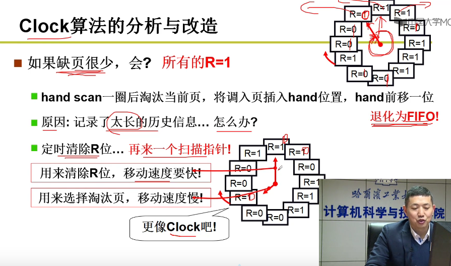

# 对操作系统的理解

操作系统有三大主题元素，分别是虚拟化，并发和持久性。

虚拟化是指CPU虚拟化，内存虚拟化，操作系统通过调度、虚拟内存管理实现这两个功能。这两个虚拟化完成之后相当于在各个程序和硬件之间构建好了软件层，提供了一个抽象。

并发就是解决多线程多进程的问题，使得多个程序在宏观上能看起来同时执行。

那么持久性则是需要硬件和软件来持久性地存储数据。

实现了前面说到地三个主题元素，那么操作系统做什么的概念就出来了，操作系统取得CPU、内存或磁盘等物理资源，并对他们虚拟化。它处理与并发有关的麻烦且棘手的问题。它持久地存储文件，从而使他们长期安全。

## 一、虚拟内存

虚拟内存优点：

（1）扩大地址空间。每个进程独占一个4G空间，虽然真实物理内存没那么多。

（2）内存保护：防止不同进程对物理内存的争夺和践踏，可以对特定内存地址提供写保护，防止恶意篡改。

（3）可以避免内存碎片，虽然物理内存可能不连续，但映射到虚拟内存上可以连续。

### 分段

**每个程序存储在磁盘上，被分成特定的段,如代码段，堆，栈，加载至内存中，程序中的地址为偏移量，当运行时被重定位，也就是加上基地址。重定位过程：每个段都有一个基地址记录在程序的“PCB（控制块）”中。基地址根据查段表得到（此表名为LDT），也叫寄存器（内存映射表，段表），每个进程都有自己的LDT，由硬件操作查询。每次进程进程切换，表中的基地址也会被更改。**

在地址转换的基础上，再增加硬件支持，将程序每个段分开存入物理内存，这样就能避免内部碎片，提高内存的适用。具体做法就是，加入寄存器，可以通过地址的前两位来当标志位，显式地说明要引用的段，任然保持基址和界限寄存器，针对不同的段寄存器则不同。

### 分页

**在操作系统初始化的时候，把物理内存分成一页一页的，每一页都有记录是否被使用，如每4K一页；同时程序的每个段也被等分成页，换算成多少页，不足时取整。将页存入内存。**

相应的，把物理内存看成定长槽块的阵列，叫做页帧。

>分页比较灵活，操作系统能够高效地提供地址空间的抽象。
>
>分页提供的空闲空间管理具有简单性。

分页比较慢，需要许多额外的内存访问来访问页表，分页也会造成内存浪费，内存被页表塞满而不是有用的应用数据程序，**引入“快速地址转换”和“较小的表”**可解决这两个问题。

### 段页结合

段页结合才是操作系统的内存管理，完美的实现虚拟内存。面向程序员，需要提供段的方式，即代码是分段且连续的，面向底层硬件，需要使用页的方式进行存储。

首先用户程序运行时，对物理地址访问，需要**地址重定位：**在段表中转换得到虚拟地址，虚拟地址再放入页表中映射真实地物理地址。

**以fork创建进程为例：**

 **1.为进程分配虚存，建立段表**

 **2.分配内存建立页表**

 **3.使用内存**

**当读的时候父子进程共用内存，但是一旦一个开始写，则会为它分配新的内存，即新申请一个内存页，修改页表重新进行地址映射，MMU重新寻址，这样便能实现多进程的不冲突，地址分离，让影响相互独立，也就是常说的写时复制**

#### 快速地址转换

多级页表增加了内存访问次数，需要引进更加快速的内存映射与查找方式，引入新的硬件机制，硬件缓存，TLB：地址转换旁路缓冲存储器。原理就是程序对某一个内存位置一般会连续访问，如数组，那么此时引入了硬件缓存，很容易便能找到下一个要访问的物理地址，完成转换。

##### TLB未命中

​	未命中时，可由硬件或者软件来处理。硬件依靠复杂指令集（CISC），软件采用精简指令集（RISC）。

软件处理未命中，一般是用户态->(暂停指令流、中断)->内核->(更新TLB)->用户。

##### TLB替换策略

一种时替换最近最少使用的项（LRU）。这种策略可能会每次都触发TLB未命中。

一种是随机替换。

##### TLB的问题

+ 一个程序短时间内访问的页的数操过了TLB的页数，会产生大量的TLB未命中，一个解决办法是加大页的大小，是TLB的覆盖率有所增加。
+ TLB容易成为CPU流水线的瓶颈，例如，地址转换必须发生在一些其他硬件缓存之前，这会拖慢速度。解决办法是用虚拟地址直接访问缓存。

#### 多级页表

**三级页表转换方法：（两步）**

（1）逻辑地址转线性地址：段起始地址+段内偏移地址=线性地址

（2）线性地址转物理地址：

每一个32位的线性地址被划分为三部分：页目录索引（10位）、页表索引（10位）、页内偏移（12位）

- 从cr3中取出进程的页目录地址（操作系统调用进程时，这个地址被装入寄存器中）
- 页目录地址 + 页目录索引 = 页表地址
- 页表地址 + 页表索引 = 页地址
- 页地址 + 页内偏移 = 物理地址
  

### 内存换入

并不是所有的页都会被映射，有时虚拟内存也会大于物理内存，所以可以在地址发生请求时才映射，也就是部分映射。当程序执行时，发现页错误，找不到页，于是产生中断，在中断中完成把磁盘数据加载到内存中，同时记录在页表中，由此完成新的一页内存映射。

### 内存换出

 当内存满了的时候，需要把一些内存页换入到磁盘中。

在换入的时候，需要进行一个判断，是否有空闲页面，如果没有的话需要换出去一些页。那么需要换什么页呢？此处需要一些算法计算。衡量这个算法的标准就是缺页次数（就是程序运行，产生了几次缺页）。

#### FIFO先进先出

换掉最先分配的页，与队列一样。

#### MIN最优淘汰

选最远将要使用的页淘汰，即用后面的页面请求来进行当前的决策。（需要知道将来的一个情况，也就是知道后面会访问那些页）。

#### LRU最近最少使用

因为无法预知将来的情况，所以使用过去来预测未来。也就是选最近最长时间没有使用的页淘汰。

#### LRU近似实现--将时间计数变为是和否（最近是否使用）--CLOCK算法

当正常进行页面访问时，可以在MMU中将访问的页置为1，表示最近访问过。当缺页时，使用扫描，转圈，是1置为0，是0淘汰。

不用操作系统维护一个复杂的数据结构，所以很快。

#### CLOCK算法缺陷与改造

缺页很少，扫描的很慢时，无法体现“最近“的味道，因为还没产生缺页，大家又都被访问过一遍了，都是1了。所以发生缺页时扫描了一圈，发现都是1，最后又回到最初，剔除第一个，退化为fifo。

**使用双指针，一个扫描指针定时（在定时中断中操作）清零即可**。

## 二、锁

## 三、条件变量

## 四、信号量

